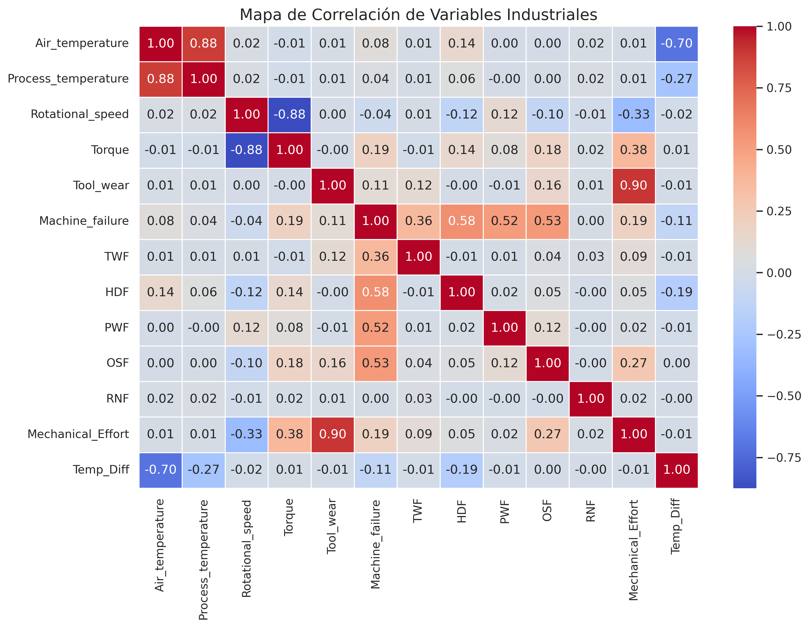
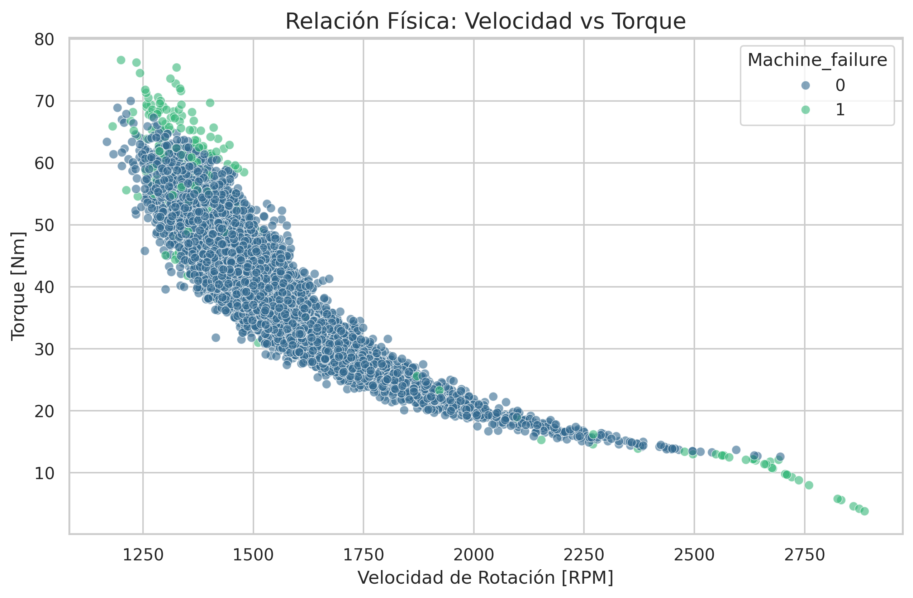

# 🏭 Industrial Predictive Maintenance & Root Cause Analysis
Industrial Predictive Maintenance (AI4I 2020) merging Mechanical Eng. & Data Science. XGBoost model optimized for ROI (€7.8k savings). Features physics-based engineering (Mechanical Effort), multiclass root cause analysis (HDF, OSF, PWF, TWF), and Streamlit deployment. Focused on business impact, reliability, and operational cost reduction.

### *Bridging Mechanical Engineering & Data Science for Industry 4.0*

Este proyecto no es solo un modelo de Machine Learning; es una **solución de ingeniería** diseñada para transformar la telemetría cruda de sensores en decisiones de mantenimiento que ahorran miles de euros. Como Ingeniero Mecánico y Científico de Datos, el enfoque aquí es la **explicabilidad física** y la **rentabilidad operativa**.

---

## 🎯 1. El Problema de Negocio (Business Case)

En el sector industrial, la precisión ($Accuracy$) es una métrica engañosa. Lo que realmente importa es el **Impacto Económico**. En este proyecto, definimos una **Función de Coste Asimétrica**:

* **Fallo Catastrófico (Falso Negativo):** **2.500 €** (Coste de rotura, reparación urgente y parada de línea).
* **Inspección Innecesaria (Falso Positivo):** **200 €** (Coste de mano de obra técnica y lucro cesante por parada breve).

**Resultado:** Logramos reducir el coste operativo total de **39.700 €** (Baseline) a **31.900 €** mediante un modelo optimizado de XGBoost, priorizando la detección de roturas críticas antes de que ocurran.

---

## ⚙️ 2. Ingeniería de Características con Base Física

El conocimiento del dominio es el "Superpoder" de este modelo. En lugar de usar solo datos brutos, inyectamos leyes físicas al dataset AI4I 2020:

* **Esfuerzo Mecánico ($Mechanical\ Effort$):** $$Mechanical\ Effort = Torque \times Tool\ Wear$$
    Representa el estrés acumulado en la estructura de la herramienta. Es el predictor número 1 para fallos de sobreesfuerzo (OSF).

* **Gradiente Térmico ($\Delta T$):** $$\Delta T = Process\ Temperature - Air\ Temperature$$
    Basado en la Ley de Enfriamiento de Newton. Un gradiente bajo indica una incapacidad de la máquina para disipar calor, disparando fallos térmicos (HDF).

---

## 📊 3. Análisis Exploratorio (EDA)
Para entender el comportamiento de la maquinaria, realizamos un análisis profundo de las variables:

*Figura 1: Relación entre variables de sensores y tipos de fallo.*

*Figura 2: Identificación de zonas críticas de operación.*

## 🤖 4. Arquitectura del Modelo y Diagnóstico

Implementamos un pipeline de clasificación multiclase capaz de identificar la **causa raíz** del fallo:

1.  **HDF (Heat Dissipation Failure):** Fallo por refrigeración insuficiente.
2.  **OSF (Overstrain Failure):** Fallo por exceso de carga mecánica.
3.  **PWF (Power Failure):** Fallo por suministro o capacidad del motor.
4.  **TWF (Tool Wear Failure):** Desgaste crítico del filo de corte.

### 💡 La Decisión Senior: El Dilema de SMOTE
Durante el desarrollo, aplicamos **SMOTE** para balancear las clases. Aunque el *Recall* del fallo por desgaste (TWF) se duplicó, la precisión cayó drásticamente, generando un **90% de falsas alarmas**. 
> **Decisión:** Se optó por el modelo **Pre-SMOTE** para producción. En la industria, la **confianza del operario** y la **estabilidad del TCO (Total Cost of Ownership)** son más importantes que una métrica de laboratorio.

---

## 📊 5. Comparativa de Resultados

| Modelo | Recall (Detección de Fallos) | Precision (Fiabilidad Alerta) | F1-Score |
| :--- | :---: | :---: | :---: |
| Random Forest | 77% | **82%** | 0.80 |
| **XGBoost Optimized** | **83%** | 71% | 0.77 |
| XGBoost + SMOTE | 88% | 10% | 0.13 |

---

## 💻 6. Despliegue: Dashboard Interactivo en Streamlit

Para que el modelo sea accionable, se desarrolló una aplicación web interactiva. Los técnicos pueden ajustar los sliders de telemetría y obtener un **diagnóstico en tiempo real** con la probabilidad de cada tipo de fallo.

* **Tecnologías:** Streamlit, XGBoost, Joblib, Scikit-Learn.
* **UI/UX:** Semáforo de estado de salud y desglose de causas raíz.

**

---

## 🚀 Conclusiones y Futuro
Este proyecto demuestra que la **Industria 4.0** no trata solo de importar librerías, sino de entender el impacto de un modelo mal ajustado en la cuenta de resultados. 

**Próximos pasos:** Implementar análisis de vibraciones mediante Series Temporales (LSTMs) para capturar la firma acústica del desgaste de herramienta (TWF) que los sensores de baja frecuencia omiten.

---

## 👤 Sobre el Autor

**Julen Neila Garcia** *Ing. Mecánico y Científico de Datos de formación*; y apasionado de resolver desafíos complejos en el sector industrial mediante Inteligencia Artificial. Especializado en el diseño de sistemas de mantenimiento predictivo y optimización de procesos, mediante soluciones de ML y DL, que impulsan la competitividad en entornos de fabricación inteligente.. 

## ⚖️ Licencia y Atribución

### Datos Originales
El dataset utilizado es el **AI4I 2020 Predictive Maintenance Dataset**, disponible en el [UCI Machine Learning Repository](https://archive.ics.uci.edu/ml/datasets/AI4I+2020+Predictive+Maintenance+Dataset).

**Cita oficial:**
> Matzka, S. (2020). AI4I 2020 Predictive Maintenance Dataset. UCI Machine Learning Repository. https://doi.org/10.24432/C5G596.

### Licencia del Proyecto
Este proyecto está bajo la licencia **Creative Commons Attribution-NonCommercial-ShareAlike 4.0 International (CC BY-NC-SA 4.0)**.
